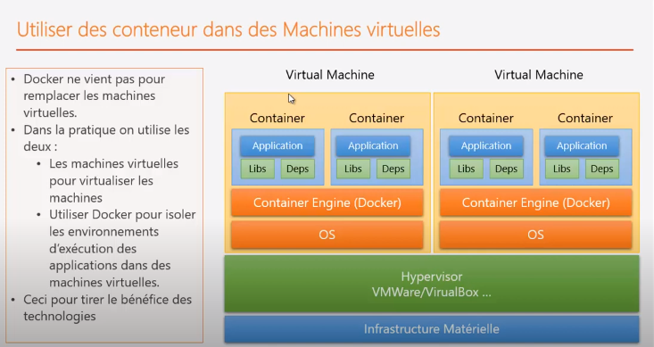

# Virtualisation_Containerisation
Demo sur les concepts de bases et la mise en œuvre des la virtualisation et de la containerisation.


# Introduction


L'infrastucture a évolué depuis des années de l'architecture physique ( avec des ordinateurs physiques, infrastructure matrielle et systeme d'exploitation ) vers la ```virtualisation``` grace au ```Hypervisor``` qui permet de créer des machines virtuelles sur la meme machine physique.

Il faut noter une chose ce que la machine virtuelle ca reste comme meme lourde, quand on démarre une machine virtuelle ( on va créer un ensemble de composant virtuel, c'est la virtualisation des composants de la machine physique, puis il faut démarrer le BIOS, le system et quand le système a démarré c'est qu'a ce moment là qu'on pourrait utiliser nos applications.

* C'est pesant en terme de Boot : Le démarrge ca prend du temps, 
* C'est pesant en terme d'ulitsation des resources: ca consomme bcq de resource CPU, DisqueDur et en terme de mémoire.

C'est la raison pour laquelle on a pensé a virtualier que les applications, pour cela on a changé vers la ```containerisation```.
### ```La containerisation```
* on a une infrastructure matérielle
* on a un systeme d'exlpotation hôte ( dans la majourité des cas c'est Linux )
* on a un Container Engine au lieu de Hypervisor de virtualisation
* an a un conteneur, chaque conteneur contient une application avec ces dépendances , c'est une manière d'isoler une application de cette facon on peut l'executer dans n'importe où.
Parmis les choses aussi c'est en utilisant cette approche , on est sur que notre application sera executée correctement dans n'importe quelle machine puisque l'envelope ( container ) contient tout ce que l'application a besoin a condition que la machine dispose d'```Container Engine```.
### ```Le Pourquoi```


### ```Conteneur VS Virtuel Machine```


### ```Uilisations de conteneurs```


### ```Historique```


### ```C'est quoi Docker```


### ```Architecture```


### ```Images Vs Conteneurs```


### ```Docker dans DevOps```


PS: vous trouvez aussi les # modes de configuration reseau dans une VM dans le meme repertoire.

# Docker Partie Pratique
### Commandes de base


### Mapping Ports


### Mapping Volume


### Inspection Conteneur


### Logs Conteneur

