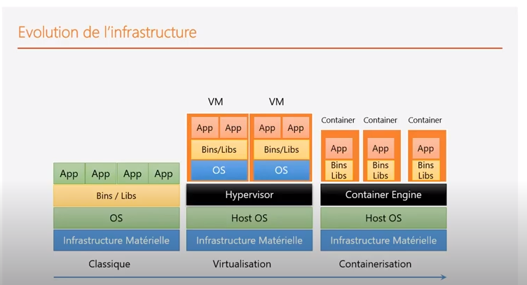

# Virtualisation_Containerisation
Demo sur les concepts de bases et la mise en œuvre des la virtualisation et de la containerisation.


# Introduction:


L'infrastucture a évolué depuis des années de l'architecture physique ( avec des ordinateurs physiques, infrastructure matrielle et systeme d'exploitation ) vers la ```virtualisation``` grace au ```Hypervisor``` qui permet de créer des machines virtuelles sur la meme machine physique.
Il faut noter une chose ce que la machine virtuelle ca reste comme meme lorde, quand on démare une machine virtuelle ( on va créer un ensemble de composant virtuel, c'est la virtualisation des composants de la machine physique, puis il faut démarer le system le BIO et quand le systeme s'est démarer c'est qu'a ce moment la qu'on pourarit utiliser nos applications.
L'orde en terme de Boot de démarge ca prend du temps, en terme d'ulitsation des resources ca consomme bcq de resource CPU, DisqueDur et en terme de mémoire.
C'est la raison pour laquelle on a pensé a virtualier que les applications 
